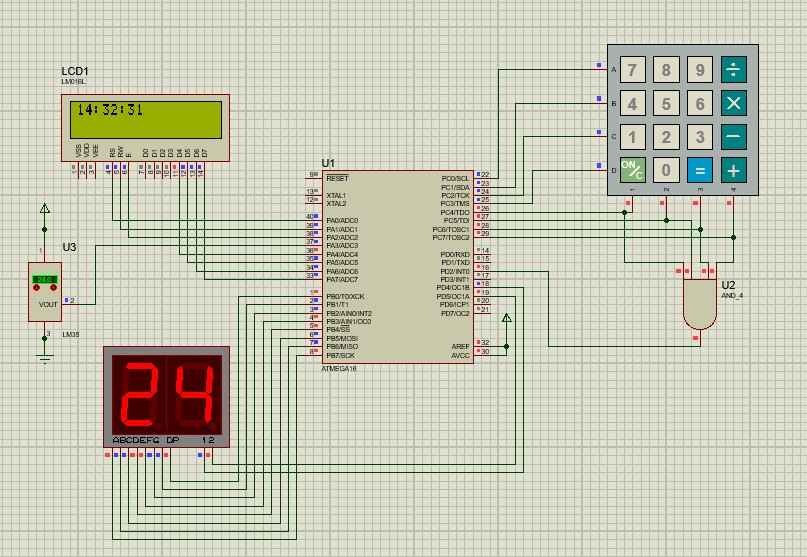

# Digital Clock Project with Temperature Display

In this project, we aim to design a digital clock with adjustable settings that displays the time on an LCD. The clock is set using a keypad. Additionally, the system can display the ambient temperature on a two-digit seven-segment display using an LM35 temperature sensor. The temperature is updated every 30 seconds.

* This project implemented in AVR Atmega16 microcontroller and programmed with C.

## Contact
Hamidreza Ghorbani - hamidrezaghorbani1382@gmail.com

Project Link: https://github.com/hamidrg/AVR_Atmega16
